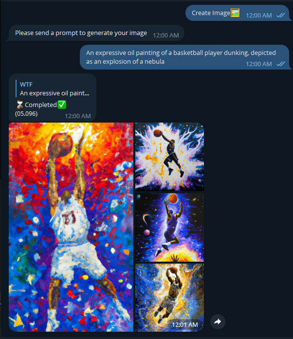

# Telegram Bot for Image Generation with DALL-E OpenAI

This Telegram bot allows users to generate images with the DALL-E OpenAI model. Users can send a prompt to the bot, which will generate an image according to the prompt. The bot is highly customizable, allowing users to set the image size and count, and even configure their own OpenAI API key.
If you would like to test this project, you can try it out by using the <a href="https://t.me/aidalle_bot" target="_blank">AI DALL-E Bot</a> on Telegram.

## Features
- Generate images with the DALL-E OpenAI model
- Customize image size and count
- Configure your own OpenAI API key
- Admin panel for managing users and settings
- Ban users and search by Telegram user ID
- Turn off the bot
- Get log reports
- Configure rate limiting by admin
- Communicate with one or all users
- Admin can view OS Details

## Getting Started
1. Clone the repository to your local machine.
2. To create an OpenAI API key, go to the <a href="https://platform.openai.com/account/api-keys" target="_blank">API Key dashboard</a> in your web browser.
3. Click on the "Create API key" button.
4. Copy the API key and keep them secure, as they will be required to authenticate requests to the OpenAI API in your .NET app.
5. Open the `appsettings.json` file in your .NET app.
6. Find the `OpenAISettings` section and replace the placeholder `YOUR_API_KEY` 
7. To create a Telegram bot, go to the <a href="https://t.me/botfather" target="_blank">BotFather</a> on Telegram and follow the steps to create a new bot and obtain a bot token. Copy the bot token and keep it secure, as it will be required to communicate with the bot in your .NET app.
8. To find the user ID of your bot, go to the <a href="https://t.me/userinfobot" target="_blank">UserIDInfo</a> and copy id
9. Find the `TelegramBotSettings` section and replace the placeholder `YOUR_BOT_TOKEN` and `YOUR_USER_ID` with the bot token and user ID you obtained in steps 7 and 8, respectively.
10. Save the  `appsettings.json` file.

## Usage
To get started, simply send the /start command to the bot. This will display the main menu with options to create an image or access your account information.
To create an image, select the "Create Image" option from the menu. The bot will then guide you through the process of entering your desired text and selecting image options.
To configure image size and image count and configure API key, select the "Account" option from the menu. From there, you can change your image size and image count and own OpenAI API key settings.

## Admin Panel
To access the admin panel, send the /start command to the bot. From there, you can manage users, ban or search them, turn off the bot, get log reports, and more. Send the /start command to access the panel.

### Contact
If you have any questions, suggestions, or issues with the bot, please feel free to contact us. You can reach us via email at <a href="mailto:kianshabanpourr@gmail.com">kianshabanpourr@gmail.com</a>, which will open your email client to send a message to us. Alternatively, you can also contact us through our Telegram at <a href="https://t.me/jkianj" target="_blank">@jkianj</a>. We would be happy to assist you in any way we can.

Dear fellow developers,
If you have found our project to be useful, we kindly request that you show your support by starring it on GitHub.

Best regards
[Kian]